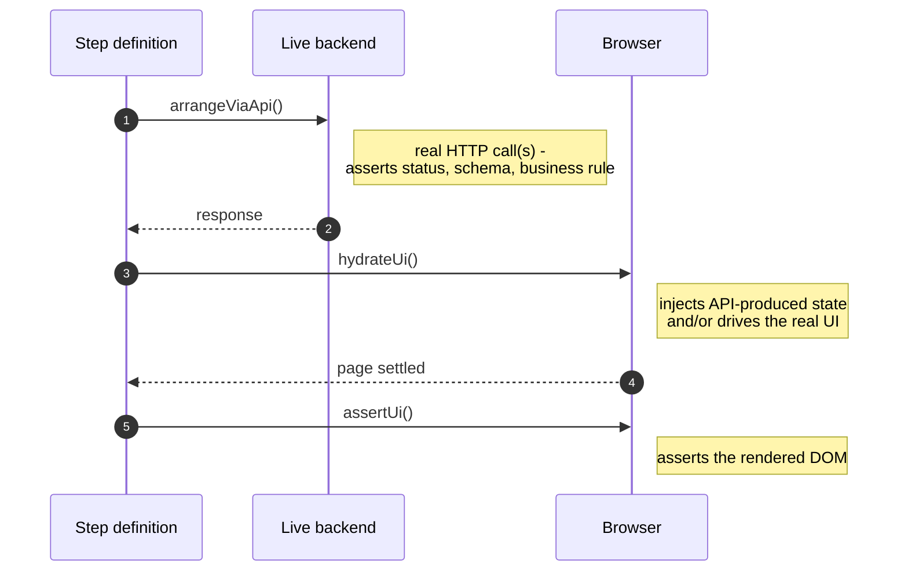
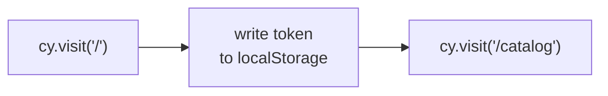
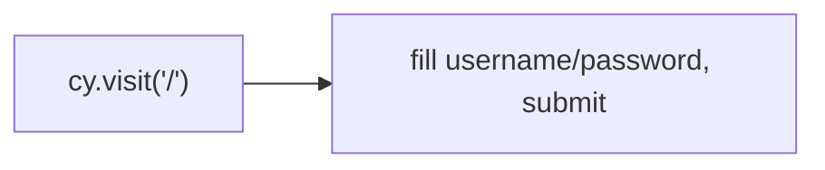
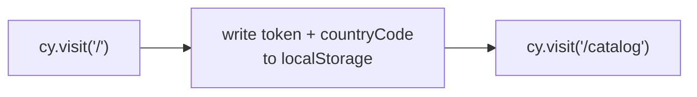
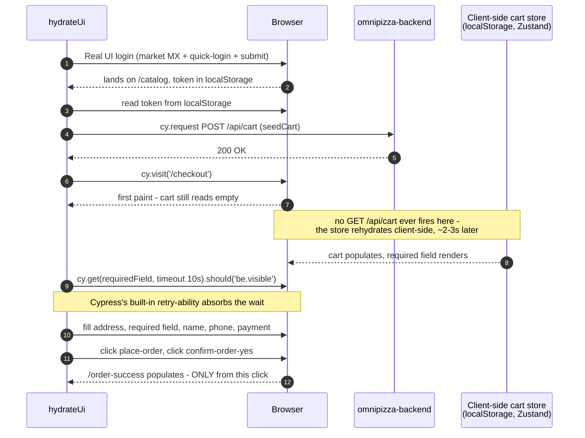
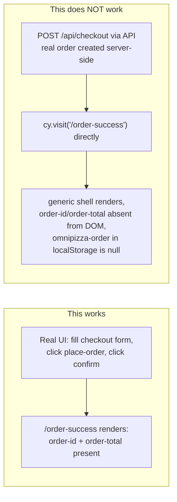
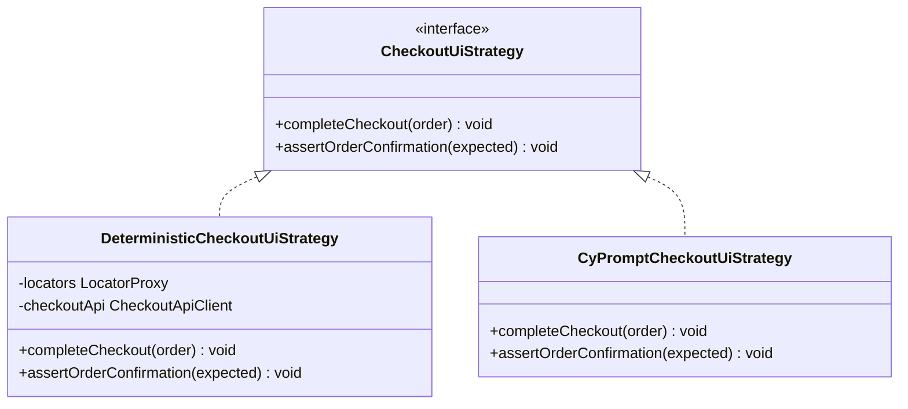

# cypress-conf-2026

An atomic-testing framework built for Cypress Conf 2026, testing a real, independently deployed
system — [OmniPizza](https://gsanchezm.github.io/OmniPizza/) — end to end. Every test proves the API
contract, hydrates that API-produced state into the UI, and asserts the rendered DOM, all in one
atomic run: no hidden coupling between "the API suite" and "the UI suite."

- **Frontend under test:** https://omnipizza-frontend.onrender.com
- **API under test:** https://omnipizza-backend.onrender.com (`/api/docs` for Swagger)

## Status

| Slice | Status |
|---|---|
| Core framework (`AtomicScenario`, `BaseApiClient`, `LocatorProxy`, Observer reporting) | ✅ Done |
| Auth & Session | ✅ Done |
| Market & Catalog i18n (5 markets: MX/US/CH/JP/SA) | ✅ Done |
| Cart & Checkout (multi-country, 5 markets: US/MX/CH/JP/SA) | ✅ Done |
| Orders & edge cases | ❌ Out of scope (decision made 2026-08-19) — see below |
| `cy.prompt` suite (`UI_STRATEGY=cyPrompt`, Checkout only) | ✅ Built, structurally verified — AI-resolution correctness needs a live Cypress Cloud run (see below) |

The description above is the framework's design contract, and it's a live-verified one — Auth, Catalog,
and Checkout (all 5 markets) all pass under real `cypress run` executions against the live app, not just
direct browser automation. An earlier version of this README noted that this workstation's outbound
HTTPS to the OmniPizza hosts was broken for `cypress run`/`curl`/Node `https` alike - that was Kaspersky
intercepting the local Cypress process tree, not a real API outage, and it was fully resolved by
uninstalling Kaspersky (2026-08-20). `cypress open`/`cypress run` both work normally now.

**Orders is deliberately out of scope.** Live testing confirmed the OmniPizza frontend has no
order-history page (`/orders` redirects to `/catalog`) and no cancel UI anywhere — including
`/order-success`, which was confirmed to be a frozen snapshot from the moment an order is placed: an
order cancelled via the API afterward still renders as "out for delivery" on reload, with no dynamic
status awareness at all. The API itself is fully verified (`GET /api/orders`, cancel `409` on a second
attempt, `403` on cross-user access), but since this framework's whole thesis is that every test proves
both the API and the UI in one atomic run, there is no honest way to build Orders as a
`AtomicScenario`-shaped slice — it would need to fake a UI assertion. Decision: skip it rather than
compromise the pattern.

Checkout's 5 markets were each verified live before code was written against them: route names,
form-submission flow, exact API field values, and per-market rendered total-text formatting (plain
ASCII for US/MX, a no-break space for CH, comma-grouped fullwidth yen for JP, RTL marks + Arabic-Indic
digits for SA) all came from direct browser inspection, never assumed. Each scenario places two real
orders against the live backend (one via `arrangeViaApi`, one via the UI in `hydrateUi`) under the same
deterministic user — 10 orders per full Checkout run. Fine for a demo/free-tier deploy; worth knowing
before scaling the matrix further.

`DeterministicCheckoutUiStrategy.completeCheckout()` seeds the cart via API (`CheckoutApiClient.seedCart`)
instead of clicking catalog's "add to cart" button — live-verified 2026-08-20 that a `cy.request()`-seeded
cart (Node-side, the same mechanism used here) renders correctly on `/checkout` after a real UI login,
so re-driving catalog's add-to-cart UI here would be redundant with `CatalogFacade`'s own suite, not
additional coverage. The checkout **form** itself (address, required field, name, phone, payment,
place-order, confirm) still runs through real UI interaction — `/order-success`'s order-id/order-total
only populate from that real submit, live-confirmed to be unreachable via API-placed order + direct
navigation (the client-side order store stays empty, so those elements never render). `/checkout`'s cart
also renders empty on first paint and populates a moment later — a client-side store rehydration, not a
network fetch — so the required-field check after the API seed needs headroom beyond Cypress's default
4s command timeout. `CyPromptCheckoutUiStrategy` is untouched by this — it still drives catalog's
add-to-cart through natural language, since its whole premise is exercising the AI-resolved UI path.

**The `cy.prompt` suite covers Checkout only** (spec §10 names only `CyPromptCheckoutUiStrategy` — no
cy.prompt work for Auth/Catalog, to keep the free-tier prompt budget small). Every `checkout.feature`
scenario can run through `DeterministicCheckoutUiStrategy` (the default — `LocatorProxy` + `cy.get()`)
or `CyPromptCheckoutUiStrategy` (Cypress's AI-native `cy.prompt()`, one batched call per business
action), selected via `Cypress.env('UI_STRATEGY')`:

```bash
pnpm exec cypress run --spec cypress/e2e/checkout/checkout.feature --env UI_STRATEGY=cyPrompt --browser chrome --record --key <your key>
```

Locally this needs `cypress open`/`cypress run` while logged into Cypress Cloud; in CI it's
`.github/workflows/cy-prompt-suite.yml` (`workflow_dispatch` only, never on push/PR, to avoid burning
Cloud quota on every commit). Free-tier budget: 100 prompts/hour. Each scenario makes exactly 2
`cy.prompt()` calls (`completeCheckout` batches 10 steps, `assertOrderConfirmation` batches 2), so a
full run is 10 calls - **but whether Cypress Cloud's hourly limit counts `cy.prompt()` calls or
individual batched steps is unverified from this sandbox**. If it's steps, a full run costs 60, not 10,
and two runs plus a retry could exhaust the free tier mid-demo. Confirm which it is (Cypress Cloud
dashboard, or spec §14) before relying on repeated runs close together.

This sandbox could not log into Cypress Cloud to exercise `cy.prompt`'s actual AI resolution against the
live app. What was verified here: `tsc` is clean, and a throwaway diagnostic spec (since deleted) proved
`CyPromptCheckoutUiStrategy`'s calls genuinely reach Cypress's real `cy.prompt()` command and attempt
Cloud initialization — failing with `CypressError: Failed to download cy.prompt Cloud code: ECONNRESET:
request to https://api.cypress.io/cy-prompt/session failed`, the same category of live-network limitation
this sandbox hits on every other host, not a code defect. Whether the AI correctly resolves prompts like
"enter the required delivery-detail field for this country" against the real DOM for all 5 markets needs
one live run — triggered by you, either locally or via `cy-prompt-suite.yml` — before relying on this
suite for the talk.

## Architecture

Vertical slicing, not layered folders — each slice under `src/features/<slice>/` is independently
readable, demoable, and deletable:

```
cypress/
├── e2e/{auth,catalog,checkout}/*.feature   # Gherkin - pure business language, no "click"/"selector"/"API"
└── support/e2e.ts                           # composition root (browser-side DIP wiring)
src/
├── core/
│   ├── http/        BaseApiClient, ApiError, parseApiResponse (pure, Node-testable)
│   ├── ui/           AtomicScenario, runAtomicSteps (pure, Node-testable)
│   ├── locators/      LocatorProxy
│   ├── types/         shared contracts used by 2+ slices
│   ├── config/         shared constants (e.g. localStorage keys)
│   └── reporting/      Observer, ReportingSubject, ConsoleObserver, GithubActionsSummaryObserver
└── features/
    ├── auth/      {api, facade, data, steps, locators/*.json}
    ├── catalog/   {api, facade, steps, locators/*.json}
    └── checkout/  {api, facade, data, steps, strategies, locators/*.json}
```

### The atomic flow — `AtomicScenario`

Every scenario runs the same three steps, in this order, enforced by a Template Method:

```
1. arrangeViaApi()  → real API call(s) via BaseApiClient - asserts the API contract itself
                       (status, schema, business rule).
2. hydrateUi()       → injects that API-produced state into the browser (token/session, cy.visit).
3. assertUi()        → asserts the rendered DOM reflects that state.
```

```typescript
AtomicScenario.for('catalog').run({ arrangeViaApi, hydrateUi, assertUi });
```



### How hydration works

"Hydrate" doesn't mean one fixed technique here - each slice's `hydrateUi` uses whatever the live app
actually allows, discovered by testing against the real DOM rather than assumed.

**Auth - standard login: pure injection.** There's nothing to prove about the login form itself in this
scenario - `arrangeViaApi` already proved the credentials work via the API, so `hydrateUi` just needs an
authenticated `/catalog` to assert against.



**Auth - locked-out: pure real UI.** A failure state can't be injected - the rendered error message only
exists if the real form is actually submitted with those credentials.



**Catalog: pure injection.** Writing `token` + `countryCode` to localStorage and doing a two-phase
`cy.visit()` genuinely reproduces an authenticated, market-selected `/catalog` - live-verified to work
reliably **only on a fresh boot** (no pre-existing `omnipizza-country` blob in localStorage). Cypress's
default `testIsolation: true` clears storage between every test, so this holds for the real suite even
though it looked broken the first time it was tried in a browser session carrying leftover state from
earlier manual testing.



**Checkout: a hybrid**, and deliberately so - see the full walkthrough below.

#### Checkout's hydration, step by step



Login stays real UI here (not injection, unlike Catalog) because the composition root wires
`DeterministicCheckoutUiStrategy` to run *after* `AuthFacade.loginViaUiWithMarket` in
`checkout.steps.ts` - reusing Catalog's injection trick would be a valid alternative (same fresh-boot
caveat applies) but was left as real UI so this slice still exercises the login form and market picker
once, deliberately, rather than nowhere.

The part that **cannot** be shortcut is the checkout form submission itself, because `/order-success` has
no server fetch to fall back on:



Live-verified 2026-08-20: placing a real order via `POST /api/checkout` and then navigating straight to
`/order-success` renders the generic "out for delivery" shell, but `order-id`/`order-total` never appear
in the DOM at all - they're written by whatever client-side action fires on the real "confirm order"
click, not fetched from the server. That's the one hard boundary this framework has found so far for
API-only hydration.

#### Method reference

| Method | Slice | What it does |
|---|---|---|
| `AuthFacade.hydrateSessionAndOpenCatalog(token)` | Auth | Pure injection: two-phase `cy.visit('/')` → write token → `cy.visit('/catalog')`. Used only by the standard-login scenario. |
| `AuthFacade.submitLoginFormAs(userKey)` | Auth | Real UI: fills username/password and submits. Used by the locked-out scenario, where the failure state can only be reproduced, not injected. |
| `CatalogFacade.openCatalogAuthenticated(token, countryCode)` | Catalog | Pure injection: two-phase visit, writes `token` + `countryCode` to localStorage. Works because the app's boot logic re-derives its full `omnipizza-country` Zustand blob from that plain key - but only on a fresh boot. |
| `CheckoutFacade.seedCartViaApi(...)` | Checkout | Called from `arrangeViaApi`, not `hydrateUi` - sets market, seeds the cart, fetches the enriched/priced cart to compute a real subtotal for the API-side order. |
| `CheckoutFacade.completeCheckoutViaUi(order)` | Checkout | Delegates to whichever `CheckoutUiStrategy` the composition root wired in - the step definition never knows which one is active. |
| `DeterministicCheckoutUiStrategy.completeCheckout(order)` | Checkout | Runs after the real UI login: reads the token, seeds the cart via `CheckoutApiClient.seedCart` (API), visits `/checkout` directly, then drives the real checkout form (address, required field, name, phone, payment, submit). |
| `DeterministicCheckoutUiStrategy.assertOrderConfirmation(expected)` | Checkout | Asserts `/order-success`'s rendered order-id/order-total match the API-computed expected order - only reachable after a real form submit. |
| `CyPromptCheckoutUiStrategy.completeCheckout(order)` | Checkout | Drives the entire flow, including "add to cart", through natural-language `cy.prompt()` steps - no API shortcut, since exercising the AI-resolved UI path end to end is this strategy's whole purpose. |



### Pattern map

| Pattern | Where | Why here |
|---|---|---|
| **Proxy** | `LocatorProxy` wraps `locators/*.json` | Dot-path selector lookup with caching; throws a clear error on a missing key instead of a silent `undefined`. Replaces classic POM. |
| **Template Method** | `BaseApiClient.request()`, `AtomicScenario` | Fixes the algorithm skeleton; slices fill in only the specific steps. |
| **Facade** | `AuthFacade`, `CatalogFacade`, `CheckoutFacade` | One narrow entrypoint per slice, hides API+data+locator/strategy wiring from step definitions. |
| **Strategy** | (a) `CheckoutCountryStrategy` — per-country required-field/tip API key mapping, keyed by `CountryCode`. (b) `CheckoutUiStrategy` — one interface scoped at business-action granularity (`completeCheckout`/`assertOrderConfirmation`, matching `checkout.feature`'s `When` steps), with `DeterministicCheckoutUiStrategy` (`LocatorProxy` + `cy.get()`) and `CyPromptCheckoutUiStrategy` (`cy.prompt()`) implementations, selected via `Cypress.env('UI_STRATEGY')`. | (a) 5 genuinely different required-field/tip rules (CH/JP reuse the same DOM field but different API keys). (b) Lets a step definition invoke the same checkout action via hardcoded locators or `cy.prompt()` without knowing which — scoped per business action, not per click, so `cy.prompt`'s multi-step batching isn't thrown away. |
| **Builder** | `CheckoutRequestBuilder` | Checkout payloads have several country-conditional fields (computed property names for the required-field/tip keys) — reads better as a fluent construction than a function with many optional args. |
| **Factory** | `UserFactory` (deterministic roster, loaded from `deterministicUsers.json`) | Centralizes how test data is built per slice. |
| **Observer** | `ReportingSubject` + `Observer`, wired on `after:spec` | Decouples "a spec finished" from "who cares" — `ConsoleObserver` and `GithubActionsSummaryObserver` are both genuine subscribers; mochawesome is wired as Cypress's native `reporter` config, not a third Observer. |
| **Adapter** *(minor)* | Cucumber step-definition layer | Thin adapter between Cucumber's step matching and our Facade interface. |

**Deliberately not built** (YAGNI/KISS): a Repository layer (`ApiClient` + `Facade` already cover it),
Singleton (`Cypress.env()` is already a single config source), Command (no undo/replay requirement),
and Chain of Responsibility for checkout validation (folded into `CheckoutCountryStrategy` instead —
each country strategy composes its own required-field/tip rule, no chain needed).

## Running locally

```bash
pnpm install
pnpm run typecheck        # tsc --noEmit
pnpm run test:unit:node    # framework-internal Node unit tests (Observer, etc.)
pnpm run cy:open            # interactive runner
pnpm run cy:run              # headless, all specs
pnpm exec cypress run --spec cypress/e2e/auth/**       # one slice
pnpm exec cypress run --spec cypress/e2e/catalog/**
pnpm exec cypress run --spec cypress/e2e/checkout/**
```

Both `omnipizza-frontend`/`omnipizza-backend` are live Render free-tier deploys — no local server to
start. Render free tier can cold-start on the first request of a run; `BaseApiClient` gives the first
request extra timeout headroom for this.

## Running in CI

`.github/workflows/tests.yml` runs the deterministic suite on `push`/`pull_request` to `main` and on
`workflow_dispatch`. One matrix job per vertical slice with a live `.feature` spec — adding a slice is
a one-line matrix edit, no other CI changes. Mochawesome reports, screenshots, and videos upload as
artifacts; a per-slice results table is appended to the run's job summary automatically via
`GithubActionsSummaryObserver`.

`.github/workflows/cy-prompt-suite.yml` runs Checkout's scenarios via `CyPromptCheckoutUiStrategy`
instead — `workflow_dispatch`-only (never on push/PR, to avoid burning Cloud quota on every commit),
`--browser chrome` (Chromium-only constraint), needs the `CYPRESS_RECORD_KEY` repo secret and the
`projectId` already set in `cypress.config.ts`. It never gates the deterministic pipeline — see Status
above for what "structurally verified" means here versus a live-confirmed AI-resolution run.

## Reporting

- **Console** — enriched, colored, per-slice output during `cypress run` (`ConsoleObserver`).
- **GitHub Actions job summary** — a markdown table written to `$GITHUB_STEP_SUMMARY`
  (`GithubActionsSummaryObserver`), local no-op outside CI.
- **HTML/JSON** — `mochawesome`, wired as Cypress's native `reporter` (`cypress.config.ts`), written to
  `cypress/reports/mochawesome/` (gitignored).
