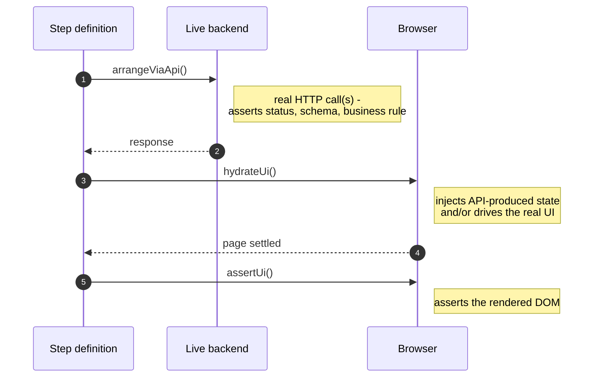
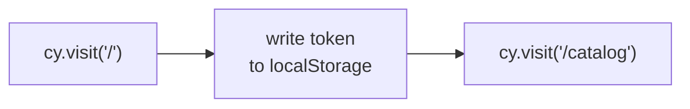
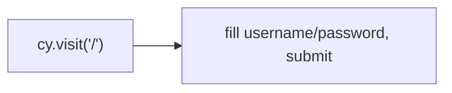
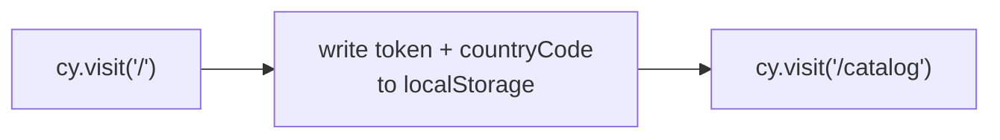
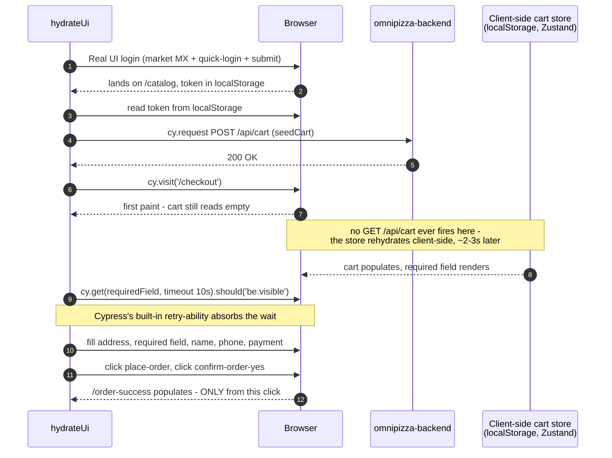
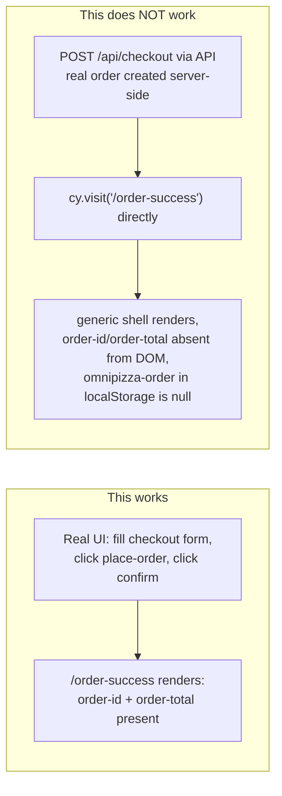
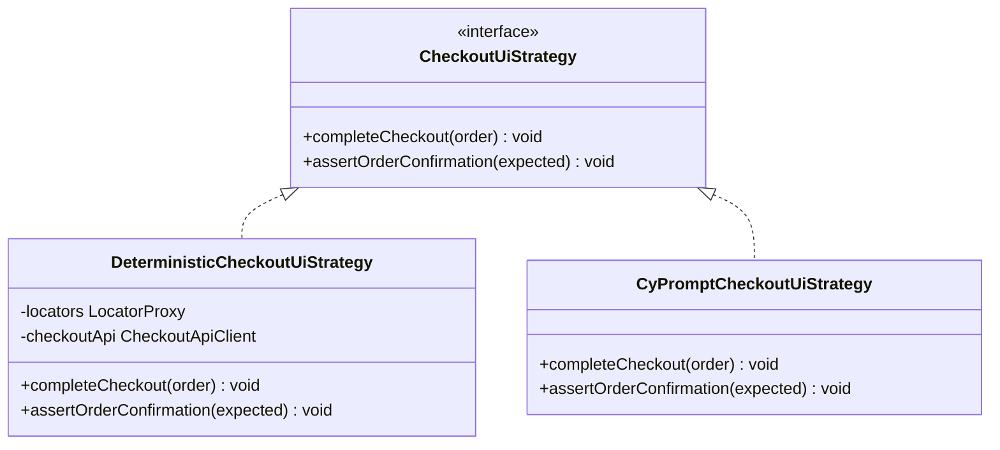

# cypress-conf-2026

An atomic-testing framework built for Cypress Conf 2026, testing a real, independently deployed
system — [OmniPizza](https://gsanchezm.github.io/OmniPizza/) — end to end. Every test proves the API
contract, hydrates that API-produced state into the UI, and asserts the rendered DOM, all in one
atomic run: no hidden coupling between "the API suite" and "the UI suite."

- **Frontend under test:** https://omnipizza-frontend.onrender.com
- **API under test:** https://omnipizza-backend.onrender.com (`/api/docs` for Swagger)

## Status

| Slice | Status |
|---|---|
| Core framework (`AtomicScenario`, `BaseApiClient`, `LocatorProxy`, Observer reporting) | ✅ Done |
| Auth & Session | ✅ Done |
| Market & Catalog i18n (5 markets: MX/US/CH/JP/SA) | ✅ Done |
| Cart & Checkout (multi-country, 5 markets: US/MX/CH/JP/SA) | ✅ Done |
| Orders & edge cases | ❌ Out of scope (decision made 2026-08-19) — see below |
| `cy.prompt` suite (`UI_STRATEGY=cyPrompt`, Checkout only) | ✅ Built, structurally verified — AI-resolution correctness needs a live Cypress Cloud run (see below) |
| Assertion-budget refactor (1 API claim + 1 UI claim per scenario) | ✅ Done — re-verified live 2026-08-21, 12/12 (auth 2, catalog 5, checkout 5) |

The description above is the framework's design contract, and it's a live-verified one — Auth, Catalog
and Checkout (all 5 markets) all pass under real `cypress run` executions against the live app, not
just direct browser automation, and were re-run after the assertion-budget refactor rewrote what each
scenario asserts (2026-08-21: 12/12). An earlier version of this README noted that this workstation's
outbound
HTTPS to the OmniPizza hosts was broken for `cypress run`/`curl`/Node `https` alike - that was Kaspersky
intercepting the local Cypress process tree, not a real API outage, and it was fully resolved by
uninstalling Kaspersky (2026-08-20). `cypress open`/`cypress run` both work normally now.

**Orders is deliberately out of scope.** Live testing confirmed the OmniPizza frontend has no
order-history page (`/orders` redirects to `/catalog`) and no cancel UI anywhere — including
`/order-success`, which was confirmed to be a frozen snapshot from the moment an order is placed: an
order cancelled via the API afterward still renders as "out for delivery" on reload, with no dynamic
status awareness at all. The API itself is fully verified (`GET /api/orders`, cancel `409` on a second
attempt, `403` on cross-user access), but since this framework's whole thesis is that every test proves
both the API and the UI in one atomic run, there is no honest way to build Orders as a
`AtomicScenario`-shaped slice — it would need to fake a UI assertion. Decision: skip it rather than
compromise the pattern.

Checkout's 5 markets were each verified live before code was written against them: route names,
form-submission flow, exact API field values, and per-market rendered total-text formatting (plain
ASCII for US/MX, a no-break space for CH, comma-grouped fullwidth yen for JP, RTL marks + Arabic-Indic
digits for SA) all came from direct browser inspection, never assumed. Each scenario places two real
orders against the live backend (one via `arrangeViaApi`, one via the UI in `hydrateUi`) under the same
deterministic user — 10 orders per full Checkout run. Fine for a demo/free-tier deploy; worth knowing
before scaling the matrix further.

`DeterministicCheckoutUiStrategy.completeCheckout()` seeds the cart via API (`CheckoutApiClient.seedCart`)
instead of clicking catalog's "add to cart" button — live-verified 2026-08-20 that a `cy.request()`-seeded
cart (Node-side, the same mechanism used here) renders correctly on `/checkout` after a real UI login,
so re-driving catalog's add-to-cart UI here would be redundant with `CatalogFacade`'s own suite, not
additional coverage. The checkout **form** itself (address, required field, name, phone, payment,
place-order, confirm) still runs through real UI interaction — `/order-success`'s order-id/order-total
only populate from that real submit, live-confirmed to be unreachable via API-placed order + direct
navigation (the client-side order store stays empty, so those elements never render). `/checkout`'s cart
also renders empty on first paint and populates a moment later — a client-side store rehydration, not a
network fetch — so the required-field check after the API seed needs headroom beyond Cypress's default
4s command timeout. `CyPromptCheckoutUiStrategy` is untouched by this — it still drives catalog's
add-to-cart through natural language, since its whole premise is exercising the AI-resolved UI path.

**The `cy.prompt` suite covers Checkout only** (spec §10 names only `CyPromptCheckoutUiStrategy` — no
cy.prompt work for Auth/Catalog, to keep the free-tier prompt budget small). Every `checkout.feature`
scenario can run through `DeterministicCheckoutUiStrategy` (the default — `LocatorProxy` + `cy.get()`)
or `CyPromptCheckoutUiStrategy` (Cypress's AI-native `cy.prompt()`, one batched call per business
action), selected via `Cypress.env('UI_STRATEGY')`:

```bash
pnpm exec cypress run --spec cypress/e2e/checkout/checkout.feature --expose UI_STRATEGY=cyPrompt --browser chrome --record --key <your key>
```

**The prompt text is not in the TypeScript.** It lives in
[`src/features/checkout/prompts/checkout.prompt.md`](src/features/checkout/prompts/checkout.prompt.md),
one `##` section per strategy method, with the rationale as prose next to the steps it explains —
editable by anyone who can read English, without touching code. esbuild's text loader
(`loader: { '.md': 'text' }` in `cypress.config.ts`) turns the import into a plain string at bundle
time, so `CyPromptCheckoutUiStrategy` stays synchronous; `cy.fixture`/`cy.readFile` would have forced a
`Chainable` through the whole `CheckoutUiStrategy` interface.

That move opens a hole, and `preparePrompt()` closes it. Inline, a renamed placeholder was a compile
error. In a markdown file, it's invisible — `cy.prompt()` would receive the literal `{addres}`, hand it
to the model, and the AI would improvise something plausible, producing a *silently wrong* test rather
than a failing one. So `preparePrompt()` cross-checks `{token}`s against supplied values in both
directions and throws on either mismatch. A `node:test` case reads the shipped `.md` from disk, so a
typo'd heading or placeholder fails during `pnpm test:unit:node` rather than during a billed Cloud run
— which is the only place `cy.prompt` can execute at all.

Locally this needs `cypress open`/`cypress run` while logged into Cypress Cloud; in CI it's
`.github/workflows/cy-prompt-suite.yml` (`workflow_dispatch` only, never on push/PR, to avoid burning
Cloud quota on every commit). Free-tier budget: 100 prompts/hour. Each scenario makes exactly 2
`cy.prompt()` calls (`completeCheckout` batches 10 steps, `assertOrderConfirmation` batches 2), so a
full run is 10 calls - **but whether Cypress Cloud's hourly limit counts `cy.prompt()` calls or
individual batched steps is unverified from this sandbox**. If it's steps, a full run costs 60, not 10,
and two runs plus a retry could exhaust the free tier mid-demo. Confirm which it is (Cypress Cloud
dashboard, or spec §14) before relying on repeated runs close together.

This sandbox could not log into Cypress Cloud to exercise `cy.prompt`'s actual AI resolution against the
live app. What was verified here: `tsc` is clean, and a throwaway diagnostic spec (since deleted) proved
`CyPromptCheckoutUiStrategy`'s calls genuinely reach Cypress's real `cy.prompt()` command and attempt
Cloud initialization — failing with `CypressError: Failed to download cy.prompt Cloud code: ECONNRESET:
request to https://api.cypress.io/cy-prompt/session failed`, the same category of live-network limitation
this sandbox hits on every other host, not a code defect. Whether the AI correctly resolves prompts like
"enter the required delivery-detail field for this country" against the real DOM for all 5 markets needs
one live run — triggered by you, either locally or via `cy-prompt-suite.yml` — before relying on this
suite for the talk.

### The broken-selector demo

The two strategies exist to be compared, and this is the comparison. Point `BREAK_LOCATOR` at any
locator key and that one selector starts resolving to `[data-cy-broken-locator="<key>"]` — an
attribute no app ships, so it matches nothing:

```bash
# Deterministic path: fails. cy.get() is looking for a selector that no longer exists.
pnpm exec cypress run --spec cypress/e2e/checkout/checkout.feature --expose BREAK_LOCATOR=checkout.address

# Same feature file, same broken key, cy.prompt path: unaffected.
pnpm exec cypress run --spec cypress/e2e/checkout/checkout.feature --expose UI_STRATEGY=cyPrompt,BREAK_LOCATOR=checkout.address --browser chrome --record
```

Nothing in the test code changes between those two commands — the composition root
(`cypress/support/e2e.ts`) picks a different `SelectorSource`, and a Decorator (`BrokenSelectorSource`)
wraps the real `LocatorProxy` for exactly one key. The broken selector names itself, so Cypress's own
message reads `Expected to find element: [data-cy-broken-locator="checkout.address"], but never found
it` — impossible to mistake for a real regression. A key no slice registers throws instead of running
green, because a demo that silently breaks nothing is the worst outcome in front of an audience.

> ⚠️ **What this demo proves, and what it does not.** It proves the deterministic path is coupled to a
> **selector registry** while the prompt path is coupled only to the **rendered UI** — `cy.prompt` never
> reads `checkout.locators.json`, so breaking that file cannot affect it. It does **not** prove
> `cy.prompt` survives a change to *the app*. On a slide those two claims read identically and only the
> first one is demonstrated here. The honest stronger version mutates the live DOM — rename the real
> `data-testid` on the element after the form renders, so the deterministic selector matches nothing
> that actually exists and the AI has to resolve the field by semantics. That is riskier (React may
> re-render and restore the attribute) but it proves what the slide claims.

**Verification status is split.** "Deterministic fails when the selector is broken" is verified locally.
"`cy.prompt` still passes" is **not** — that half needs the billed Cloud run, like everything else
`cy.prompt`.

## Architecture

Vertical slicing, not layered folders — each slice under `src/features/<slice>/` is independently
readable, demoable, and deletable:

```
cypress/
├── e2e/{auth,catalog,checkout}/*.feature   # Gherkin - pure business language, no "click"/"selector"/"API"
└── support/e2e.ts                           # composition root (browser-side DIP wiring)
src/
├── core/
│   ├── http/        BaseApiClient, ApiError, parseApiResponse (pure, Node-testable)
│   ├── ui/           AtomicScenario, runAtomicSteps (pure, Node-testable)
│   ├── locators/      LocatorProxy
│   ├── types/         shared contracts used by 2+ slices
│   ├── config/         shared constants (e.g. localStorage keys)
│   └── reporting/      Observer, ReportingSubject, ConsoleObserver, GithubActionsSummaryObserver
└── features/
    ├── auth/      {api, facade, data, steps, locators/*.json}
    ├── catalog/   {api, facade, steps, locators/*.json}
    └── checkout/  {api, facade, data, steps, strategies, locators/*.json}
```

### The atomic flow — `AtomicScenario`

Every scenario runs the same three steps, in this order, enforced by a Template Method:

```
1. arrangeViaApi()  → real API call(s) via BaseApiClient - asserts the API contract itself
                       (status, schema, business rule).
2. hydrateUi()       → injects that API-produced state into the browser (token/session, cy.visit).
3. assertUi()        → asserts the rendered DOM reflects that state.
```

```typescript
AtomicScenario.for('catalog').run({ arrangeViaApi, hydrateUi, assertUi });
```



### The assertion budget — one API claim, one UI claim

Every scenario makes **at most two assertions**: one about the API contract, one about the rendered
DOM. That isn't an arbitrary style rule — it falls straight out of the atomic thesis. If a scenario
proves the API and the UI in one run, then it has exactly two things to say, and anything beyond that
is a second test wearing the first one's clothes.

Making that countable needs a distinction the code enforces:

| | What it is | Mechanism | Counts toward the budget? |
|---|---|---|---|
| **Claim** | The product behaviour the scenario exists to prove | `expect()` / `.should()`, only inside an `assert*` method | Yes |
| **Precondition** | What must hold for the claim to mean anything (a token was issued, the response is for the market we asked for) | `precondition()` — throws `PreconditionError` | No |
| **Guard** | Waiting for the DOM to settle before reading it | `.should('be.visible')` on a ready marker | No |

`precondition()` throws rather than asserts, so a broken arrange step reads as *"Precondition not met:
the standard customer login issued an access token"* instead of masquerading as a product failure.
Guards still use `.should()` — that's how Cypress retries, and a `.then()` check would fail on anything
the app renders a tick late — so the invariant isn't "count `.should()` calls". It's: **every claim
lives in an `assert*` method on a facade or strategy; a `.should()` anywhere else is a guard by
construction.**

| Scenario | API claim | UI claim |
|---|---|---|
| Auth — standard login | *(none — this scenario is about the UI landing state)* | `pathname === '/catalog'` |
| Auth — locked out | login rejected with `403` | error text matches `/locked out/i` |
| Catalog (×5 markets) | envelope currency **and** every pizza's currency are exactly this market's ISO code | p01's rendered price is byte-for-byte `$227.97` / `￥2,051` / … |
| Checkout (×5 markets) | the placed order came back `pending` | `/order-success`'s total is byte-for-byte the API-computed total |

Two notes on how the reduction was done. Catalog's four API assertions collapsed into **one** rather
than three being deleted — envelope and per-item currencies fold into a single `Set`, so the
stale-item case a bare envelope check would miss is still caught. And **no scenario was split** to
meet the budget: a full Checkout run already places 10 real orders against a free-tier backend, so
splitting would have paid for assertion hygiene with live API load. The reduction came from removing
genuinely redundant claims, not from adding scenarios.

### How hydration works

"Hydrate" doesn't mean one fixed technique here - each slice's `hydrateUi` uses whatever the live app
actually allows, discovered by testing against the real DOM rather than assumed.

**Auth - standard login: pure injection.** There's nothing to prove about the login form itself in this
scenario - `arrangeViaApi` already proved the credentials work via the API, so `hydrateUi` just needs an
authenticated `/catalog` to assert against.



**Auth - locked-out: pure real UI.** A failure state can't be injected - the rendered error message only
exists if the real form is actually submitted with those credentials.



**Catalog: pure injection.** Writing `token` + `countryCode` to localStorage and doing a two-phase
`cy.visit()` genuinely reproduces an authenticated, market-selected `/catalog` - live-verified to work
reliably **only on a fresh boot** (no pre-existing `omnipizza-country` blob in localStorage). Cypress's
default `testIsolation: true` clears storage between every test, so this holds for the real suite even
though it looked broken the first time it was tried in a browser session carrying leftover state from
earlier manual testing.



**Checkout: a hybrid**, and deliberately so - see the full walkthrough below.

#### Checkout's hydration, step by step



Login stays real UI here (not injection, unlike Catalog) because the composition root wires
`DeterministicCheckoutUiStrategy` to run *after* `AuthFacade.loginViaUiWithMarket` in
`checkout.steps.ts` - reusing Catalog's injection trick would be a valid alternative (same fresh-boot
caveat applies) but was left as real UI so this slice still exercises the login form and market picker
once, deliberately, rather than nowhere.

The part that **cannot** be shortcut is the checkout form submission itself, because `/order-success` has
no server fetch to fall back on:



Live-verified 2026-08-20: placing a real order via `POST /api/checkout` and then navigating straight to
`/order-success` renders the generic "out for delivery" shell, but `order-id`/`order-total` never appear
in the DOM at all - they're written by whatever client-side action fires on the real "confirm order"
click, not fetched from the server. That's the one hard boundary this framework has found so far for
API-only hydration.

#### Method reference

| Method | Slice | What it does |
|---|---|---|
| `AuthFacade.hydrateSessionAndOpenCatalog(token)` | Auth | Pure injection: two-phase `cy.visit('/')` → write token → `cy.visit('/catalog')`. Used only by the standard-login scenario. |
| `AuthFacade.submitLoginFormAs(userKey)` | Auth | Real UI: fills username/password and submits. Used by the locked-out scenario, where the failure state can only be reproduced, not injected. |
| `CatalogFacade.openCatalogAuthenticated(token, countryCode)` | Catalog | Pure injection: two-phase visit, writes `token` + `countryCode` to localStorage. Works because the app's boot logic re-derives its full `omnipizza-country` Zustand blob from that plain key - but only on a fresh boot. |
| `CheckoutFacade.seedCartViaApi(...)` | Checkout | Called from `arrangeViaApi`, not `hydrateUi` - sets market, seeds the cart, fetches the enriched/priced cart to compute a real subtotal for the API-side order. |
| `CheckoutFacade.completeCheckoutViaUi(order)` | Checkout | Delegates to whichever `CheckoutUiStrategy` the composition root wired in - the step definition never knows which one is active. |
| `DeterministicCheckoutUiStrategy.completeCheckout(order)` | Checkout | Runs after the real UI login: reads the token, seeds the cart via `CheckoutApiClient.seedCart` (API), visits `/checkout` directly, then drives the real checkout form (address, required field, name, phone, payment, submit). |
| `DeterministicCheckoutUiStrategy.assertOrderConfirmation(expected)` | Checkout | Asserts `/order-success`'s rendered order-id/order-total match the API-computed expected order - only reachable after a real form submit. |
| `CyPromptCheckoutUiStrategy.completeCheckout(order)` | Checkout | Drives the entire flow, including "add to cart", through natural-language `cy.prompt()` steps - no API shortcut, since exercising the AI-resolved UI path end to end is this strategy's whole purpose. |



### Pattern map

| Pattern | Where | Why here |
|---|---|---|
| **Proxy** | `LocatorProxy` wraps `locators/*.json` | Dot-path selector lookup with caching; throws a clear error on a missing key instead of a silent `undefined`. Replaces classic POM. |
| **Template Method** | `BaseApiClient.request()`, `AtomicScenario` | Fixes the algorithm skeleton; slices fill in only the specific steps. |
| **Facade** | `AuthFacade`, `CatalogFacade`, `CheckoutFacade` | One narrow entrypoint per slice, hides API+data+locator/strategy wiring from step definitions. |
| **Strategy** | (a) `CheckoutCountryStrategy` — per-country required-field/tip API key mapping, keyed by `CountryCode`. (b) `CheckoutUiStrategy` — one interface scoped at business-action granularity (`completeCheckout`/`assertOrderConfirmation`, matching `checkout.feature`'s `When` steps), with `DeterministicCheckoutUiStrategy` (`LocatorProxy` + `cy.get()`) and `CyPromptCheckoutUiStrategy` (`cy.prompt()`) implementations, selected via `Cypress.env('UI_STRATEGY')`. | (a) 5 genuinely different required-field/tip rules (CH/JP reuse the same DOM field but different API keys). (b) Lets a step definition invoke the same checkout action via hardcoded locators or `cy.prompt()` without knowing which — scoped per business action, not per click, so `cy.prompt`'s multi-step batching isn't thrown away. |
| **Builder** | `CheckoutRequestBuilder` | Checkout payloads have several country-conditional fields (computed property names for the required-field/tip keys) — reads better as a fluent construction than a function with many optional args. |
| **Factory** | `UserFactory` (deterministic roster, loaded from `deterministicUsers.json`) | Centralizes how test data is built per slice. |
| **Observer** | `ReportingSubject` + `Observer`, wired on `after:spec` | Decouples "a spec finished" from "who cares" — `ConsoleObserver` and `GithubActionsSummaryObserver` are both genuine subscribers; mochawesome is wired as Cypress's native `reporter` config, not a third Observer. |
| **Adapter** *(minor)* | Cucumber step-definition layer | Thin adapter between Cucumber's step matching and our Facade interface. |

### What came over from the 2025 framework — and what didn't

[`cypress-conf-2025`](https://github.com/gsanchezm/cypress-conf-2025) shipped a `common/actions/`
layer: twelve `BaseAction` subclasses behind an `ActionRegistry`, dispatched by string through a
`Proxy` (`$loc.page.KEY.clickOnElement()`). Reviewing it for this year's framework turned up one thing
worth keeping and a cause-and-effect worth putting on a slide.

**Kept: `typeIfNotEmpty` → `fillField`.** 2025 re-typed through `cypress-recurse` until the input's
value matched the text, because a controlled React input can silently drop characters when a re-render
lands mid-type. This framework had five bare `.clear().type()` calls that would have surfaced such a
drop as a mystery failure at the assertion three commands later. `fillField` keeps the verification via
`.should('have.value', …)` — which retries the way `recurse` did, with no new dependency — and drops
the *"IfNotEmpty"* half: 2025 skipped empty text because SauceDemo had optional fields, but every field
here is required, so an empty value means broken test data and throws.

**It earned its keep on the first run.** All 5 markets failed immediately, in the phone field:

```
- '15551234567'     ← what the DOM actually holds
+ '+15551234567'    ← what we typed
```

OmniPizza's checkout strips the leading `+`. The bare `.clear().type()` had been hiding that
indefinitely — we typed one thing, the app stored another, and nothing ever noticed. The fix passes the
app's normalized value as `fillField`'s optional third argument rather than loosening the comparison,
so the check stays exact and a field that starts rewriting input in some *new* way still fails loudly.

Worth recording what did **not** fail: the guard ran clean on Japan's CJK address and prefecture
(`東京都渋谷区1-1-1`, `東京都`) and on Saudi Arabia's values, across all five markets. Phone is the only
normalizing input in the form.

**Not kept, and this is the interesting part.** `isElementVisible`, `waitUntilNotVisible` and
`clickUntilVisible` all hand-roll their own waiting — `if ($body.find(sel).length)`, retry loops around
`cy.wait(delay)`, booleans returned out of `.then()`. That reads like a list of Cypress anti-patterns
until you notice *why* they exist: 2025 resolved every selector **asynchronously**, through
`cy.task('loc:resolve')` into a Node-side `LocatorService`. An async selector breaks Cypress's built-in
retry-ability, so every action had to rebuild waiting by hand. 2026's `LocatorProxy` resolves
**synchronously** from a bundled JSON import, so `cy.get(sel).should(…)` retries natively and all three
have nothing left to work around.

> One decision about how you resolve a selector cost an entire actions layer.

Also not ported: the `ActionRegistry` + `LocatorPageProxy` string dispatch (in TypeScript it makes every
call `any`, turning a compile error into a runtime one — it solved a problem JS had and TS doesn't), the
`cy.task` locator round-trip, and `RegisterGenerator`'s codegen'd registration files (explicit imports
in the composition root keep go-to-definition and typechecking working).

**Deliberately not built** (YAGNI/KISS): a Repository layer (`ApiClient` + `Facade` already cover it),
Singleton (`Cypress.env()` is already a single config source), Command (no undo/replay requirement),
and Chain of Responsibility for checkout validation (folded into `CheckoutCountryStrategy` instead —
each country strategy composes its own required-field/tip rule, no chain needed).

## Running locally

```bash
pnpm install
pnpm run typecheck        # tsc --noEmit
pnpm run test:unit:node    # framework-internal Node unit tests (Observer, etc.)
pnpm run cy:open            # interactive runner
pnpm run cy:run              # headless, all specs
pnpm exec cypress run --spec cypress/e2e/auth/**       # one slice
pnpm exec cypress run --spec cypress/e2e/catalog/**
pnpm exec cypress run --spec cypress/e2e/checkout/**
```

Both `omnipizza-frontend`/`omnipizza-backend` are live Render free-tier deploys — no local server to
start. Render free tier can cold-start on the first request of a run; `BaseApiClient` gives the first
request extra timeout headroom for this.

## Running in CI

`.github/workflows/tests.yml` runs the deterministic suite on `push`/`pull_request` to `main` and on
`workflow_dispatch`. One matrix job per vertical slice with a live `.feature` spec — adding a slice is
a one-line matrix edit, no other CI changes. Mochawesome reports, screenshots, and videos upload as
artifacts; a per-slice results table is appended to the run's job summary automatically via
`GithubActionsSummaryObserver`.

`.github/workflows/cy-prompt-suite.yml` runs Checkout's scenarios via `CyPromptCheckoutUiStrategy`
instead — `workflow_dispatch`-only (never on push/PR, to avoid burning Cloud quota on every commit),
`--browser chrome` (Chromium-only constraint), needs the `CYPRESS_RECORD_KEY` repo secret and the
`projectId` already set in `cypress.config.ts`. It never gates the deterministic pipeline — see Status
above for what "structurally verified" means here versus a live-confirmed AI-resolution run.

## Reporting

- **Console** — enriched, colored, per-slice output during `cypress run` (`ConsoleObserver`).
- **GitHub Actions job summary** — a markdown table written to `$GITHUB_STEP_SUMMARY`
  (`GithubActionsSummaryObserver`), local no-op outside CI.
- **HTML/JSON** — `mochawesome`, wired as Cypress's native `reporter` (`cypress.config.ts`), written to
  `cypress/reports/mochawesome/` (gitignored).
